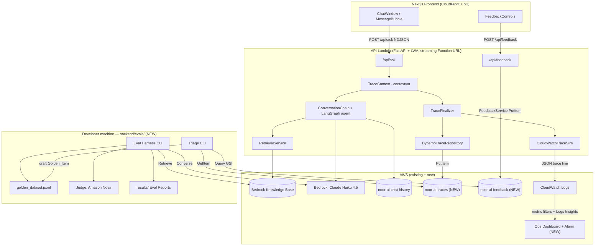
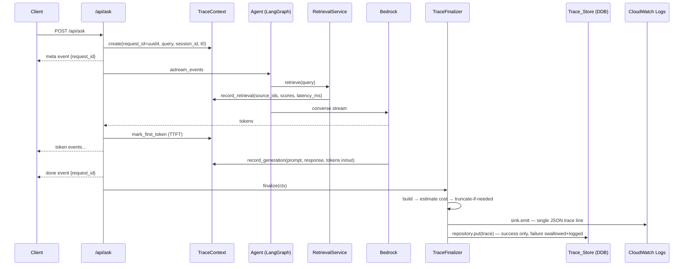
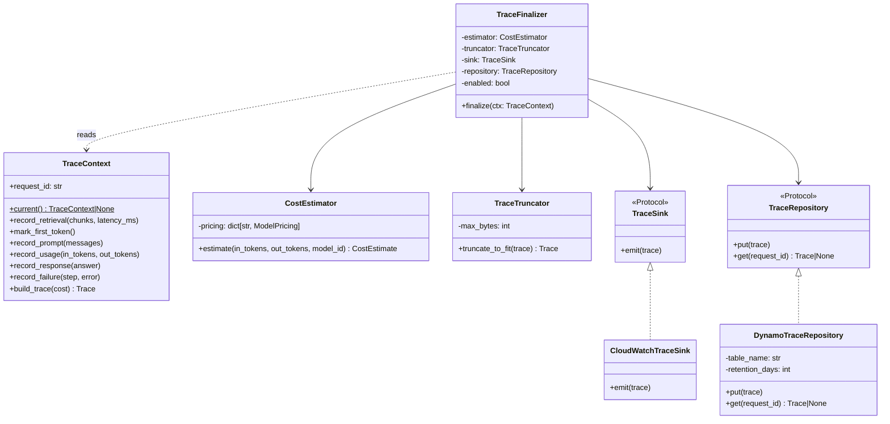
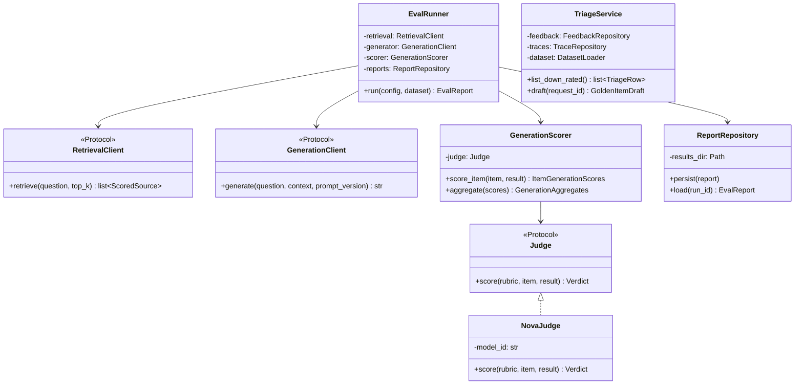

# Design Document

## Overview

This feature adds a four-part evaluation and observability system to the deployed Noor-AI RAG application:

1. **Trace logging** — a new self-contained `backend/src/observability/` package that assembles one structured JSON trace per `/api/ask` request (query, retrieved chunks, final prompt, response, timings, tokens, cost). Internally it is decomposed into single-responsibility collaborators — a request-scoped `TraceContext`, a `CostEstimator`, a `TraceSink` (emission), a `TraceRepository` (persistence), and a `TraceFinalizer` that orchestrates them — wired together via constructor injection. It emits each trace to CloudWatch Logs as a single log line and persists it to a new DynamoDB `noor-ai-traces` table keyed by `Request_ID`.
2. **Golden dataset** — a human-annotated JSONL dataset (`backend/evals/data/golden_dataset.jsonl`) of 50–100 bilingual questions labeled with expected Source_IDs, versioned via a manifest + content hash, validated on every load.
3. **Offline eval harness** — a config-driven CLI in `backend/evals/` that runs every golden item through the deployed retrieval and generation steps, computes code-based retrieval metrics (recall@k, precision@k, MRR) and LLM-as-judge generation metrics (faithfulness, citation accuracy, answer relevancy, abstention) using an Amazon Nova judge, and writes immutable versioned reports with a compare command.
4. **Online metrics and feedback** — a CDK-defined CloudWatch dashboard and error-rate alarm built from the trace log fields, a `POST /api/feedback` endpoint + DynamoDB `noor-ai-feedback` table, thumbs up/down controls in the Next.js UI linked by `Request_ID`, and a triage CLI that turns down-rated production queries into draft golden items.

Design constraints honored throughout: single developer, serverless-only, pay-per-request billing, no new always-on infrastructure. The only new AWS resources are two DynamoDB tables (PAY_PER_REQUEST, TTL), CloudWatch metric filters, one dashboard, one alarm, and an optional SNS topic — all near-zero cost at portfolio traffic levels.

Two structural principles govern the code design:

1. **New functionality lives in new files.** Observability is its own package (`backend/src/observability/`), feedback is its own package with a dedicated `APIRouter` (`backend/src/feedback/`), and the eval harness is fully self-contained under `backend/evals/`. Existing modules change only at a small, explicitly-listed set of integration touchpoints, each kept to a few lines (see *File Layout: New vs Modified Files*).
2. **Single responsibility with injected collaborators.** Each class does one thing (estimate cost, emit, persist, orchestrate); dependencies are passed in through constructors and typed as `Protocol`s at layer boundaries, so every piece is testable with in-memory fakes and no monkeypatching. Composition roots (`observability/wiring.py`, `evals/cli.py`) are the only places that construct the production object graph.

### Key design decisions

| Decision | Choice | Rationale |
|---|---|---|
| Request_ID propagation | Python `contextvars.ContextVar` holding a per-request `TraceContext` | Async-safe with FastAPI/uvicorn; no signature changes needed in `RetrievalService`/`RagToolset`; works inside LangGraph tool calls which don't receive request-scoped arguments |
| Trace emission | Single JSON line to stdout (captured by Lambda → CloudWatch Logs) | Zero infrastructure; structured fields queryable by Logs Insights and metric filters |
| Dashboard metrics | CloudWatch Logs metric filters (request count, error count, throttle count) + Logs Insights query widgets (latency/TTFT percentiles, daily cost) | Metric filters are free and power the alarm; Logs Insights widgets compute percentiles directly from trace fields without emitting extra metrics |
| Error-rate alarm | Metric math `100 * errors / requests` with `treatMissingData: NOT_BREACHING` | Satisfies the >5% threshold and the zero-traffic non-breaching requirement exactly |
| Trace_Store | DynamoDB table, PK `RequestId`, TTL attribute (default 90 days) | Point lookup by Request_ID is the only access pattern; TTL gives free retention expiry |
| Feedback store | Separate DynamoDB table, PK `RequestId`, plain `PutItem` | Overwrite-on-resubmit falls out of PutItem semantics; GSI on `Rating` for the triage listing |
| Source_ID | The existing corpus `citation` metadata value (`Quran {s}:{a}`, `Sahih al-Bukhari {n}`, `Sahih Muslim {n}`) | Already precomputed at ingestion (`build_corpus.py`), returned verbatim by the Retrieve API, and quoted inline by the model — no new ID scheme needed |
| Dataset versioning | `golden_dataset.meta.json` manifest (human label) + SHA-256 content hash; effective version = `{label}+{hash[:12]}` | The hash guarantees "different content ⇒ different identifier"; the manifest satisfies "stored with the dataset in the repository" |
| Judge model | Amazon Nova (default `us.amazon.nova-pro-v1:0`), family checked against the generation model | Different family than Claude (avoids self-preference bias), cheap, available in the same Bedrock region |
| Eval harness pipeline access | Reuses `backend/src` modules directly (`RetrievalService`, `ChatBedrockConverse`) from a developer machine with AWS credentials | No deployment round trip; the harness exercises the same retrieval index and prompt code paths as production |
| Feedback API | Dedicated `APIRouter` in a new `backend/src/feedback/` package, included into the existing FastAPI app with one line | No new compute; shares CloudFront `/api/*` routing; `app.py` stays thin |
| Code organization | New packages (`observability/`, `feedback/`, `evals/`) with constructor-injected, protocol-typed collaborators; existing files change only at listed touchpoints | Single-responsibility classes, testable with in-memory fakes, minimal diff to working production code |

## Architecture

### System context



### Request lifecycle with tracing



The trace is finalized *after* the last token is yielded but *before* the streaming generator returns, so persistence completes within the same Lambda invocation (Requirement 3.2) without delaying any visible token.

### CDK stack changes

| Stack | Change |
|---|---|
| `DataStack` | Add `TracesTable` (PK `RequestId` S, TTL attr `ExpiresAt`) and `FeedbackTable` (PK `RequestId` S, GSI `RatingIndex`: PK `Rating` S, SK `FeedbackAt` S). Both PAY_PER_REQUEST. |
| `ApiStack` | Grant read/write on both new tables; new env vars `TRACE_TABLE`, `FEEDBACK_TABLE`, `TRACE_ENABLED`, `TRACE_RETENTION_DAYS`; expose `apiLogGroup` as a public property for the observability stack. |
| `ObservabilityStack` (new, `lib/observability-stack.ts`) | Metric filters on the API log group (`NoorAi/Traces` namespace: `RequestCount`, `ErrorCount`, `ThrottleCount`); CloudWatch dashboard (Logs Insights widgets for latency/TTFT percentiles and daily cost; metric widgets for error rate and throttles); error-rate alarm on metric math `100*errors/requests > 5%` over 5 minutes, `treatMissingData: NOT_BREACHING`; optional SNS topic + email subscription when `ALARM_EMAIL` is configured. |
| `lib/config.ts` | Add `TRACE_TABLE_NAME`, `FEEDBACK_TABLE_NAME`, `TRACE_RETENTION_DAYS = 90`, `ERROR_RATE_THRESHOLD_PCT = 5`, `ERROR_RATE_PERIOD_MINUTES = 5`. |

## Components and Interfaces

### 1. Trace layer (backend/src/observability/)

New self-contained package `backend/src/observability/`. The former monolithic "TraceLogger" responsibility is decomposed into single-purpose collaborators; the glossary term **Trace_Logger** maps to this package as a whole. Nothing in the package imports from `app.py`, chains, or services — dependencies flow one way (pipeline → observability).



| Module | Class(es) | Single responsibility |
|---|---|---|
| `models.py` | `Trace`, `RetrievalRecord`, `CostEstimate`, `ModelPricing` | Immutable trace data types (schema version 1) |
| `trace_context.py` | `TraceContext` + `_current_trace` ContextVar | Request-scoped mutable accumulation; nothing else |
| `cost.py` | `CostEstimator` | Token counts + pricing → `CostEstimate` (pure) |
| `truncation.py` | `TraceTruncator` | Fit a Trace into a byte budget (pure) |
| `sink.py` | `TraceSink` (Protocol), `CloudWatchTraceSink` | Emit one serialized trace line |
| `repository.py` | `TraceRepository` (Protocol), `DynamoTraceRepository`, `TraceStoreError` | Persist/read traces in the Trace_Store |
| `finalizer.py` | `TraceFinalizer` | Orchestrate build → cost → truncate → emit → persist; own the error policy |
| `logging.py` | `log_json(level, message, **fields)` | Structured log lines with auto-injected `request_id` (Req 1.4) |
| `wiring.py` | `build_trace_finalizer()` | Composition root: read env/config, construct the production graph |

#### `trace_context.py` — request-scoped mutable trace state

```python
_current_trace: ContextVar[TraceContext | None] = ContextVar("noor_trace", default=None)

class TraceContext:
    """Mutable per-request accumulator. Created in /api/ask before any
    pipeline step; readable from anywhere via TraceContext.current()."""

    def __init__(self, query: str, session_id: str) -> None:
        self.request_id: str = str(uuid.uuid4())
        self.received_at: datetime  # UTC now
        self._t0: float             # time.monotonic()
        ...

    @classmethod
    def current(cls) -> "TraceContext | None": ...

    # Called by RetrievalService after each retrieve() call.
    def record_retrieval(self, chunks: list[RetrievedChunk], latency_ms: int) -> None: ...

    # Called from the astream_events loop.
    def mark_first_token(self) -> None: ...           # sets ttft_ms once
    def record_prompt(self, messages) -> None: ...    # last on_chat_model_start payload
    def record_usage(self, input_tokens, output_tokens) -> None: ...  # from usage_metadata
    def record_response(self, answer: str) -> None: ...
    def record_failure(self, step: str, error: str) -> None: ...

    def build_trace(self, cost: CostEstimate) -> Trace: ...  # freezes into the immutable Trace model
```

`TraceContext` only accumulates — it never computes cost, serializes, truncates, emits, or persists. Those belong to the collaborators below.

- `ContextVar` is the propagation mechanism: it is `asyncio`-task-local, so `RetrievalService.retrieve` (called deep inside a LangGraph tool with no access to request state) can record into the correct request's context without signature changes (Req 1.2).
- Request_ID is generated in the constructor, before any pipeline step runs (Req 1.1). `TRACE_ENABLED=false` skips trace *assembly/emission* but the context (and its Request_ID) is still created so streaming and feedback keep working (Req 3.7).

#### `cost.py` — `CostEstimator`

```python
class CostEstimator:
    def __init__(self, pricing: dict[str, ModelPricing]) -> None: ...

    def estimate(self, input_tokens, output_tokens, model_id) -> CostEstimate:
        """Pure. Returns not-computed when either token count is None
        or the model has no pricing entry (Req 2.5, 2.8, 2.9)."""
```

The pricing table is injected (production wiring passes `config.MODEL_PRICING`), so property tests exercise arbitrary pricing tables without touching global config. Pricing lives in `backend/src/config.py` as a dict keyed by model-ID substring:

```python
MODEL_PRICING: dict[str, ModelPricing] = {
    "anthropic.claude-haiku-4-5": ModelPricing(input_per_1k=0.001, output_per_1k=0.005),
}
```

Lookup is by substring match against the configured model ID (cross-region profile prefixes like `us.` vary). No entry ⇒ cost `not_computed` (Req 2.9).

#### `truncation.py` — `TraceTruncator`

```python
class TraceTruncator:
    def __init__(self, max_bytes: int = 250_000) -> None: ...  # under the 256 KiB CW Logs limit

    def truncate_to_fit(self, trace: Trace) -> Trace:
        """Pure. Shortens final_prompt and response (longest-first, proportionally)
        until the serialized trace fits; sets truncated=True only when content was
        removed. All other fields untouched (Req 3.8)."""
```

#### `sink.py` — `TraceSink` protocol + CloudWatch implementation

```python
class TraceSink(Protocol):
    def emit(self, trace: Trace) -> None: ...

class CloudWatchTraceSink:
    def emit(self, trace: Trace) -> None:
        """print() one JSON line: {"log_type": "trace", ...trace fields}.
        ensure_ascii=False for Arabic text (Req 3.1)."""
```

The protocol keeps emission swappable (tests use an in-memory `RecordingSink`); the production sink is a plain stdout writer because Lambda routes stdout to CloudWatch Logs.

#### `repository.py` — `TraceRepository` protocol + DynamoDB implementation

```python
class TraceRepository(Protocol):
    def put(self, trace: Trace) -> None: ...
    def get(self, request_id: str) -> Trace | None: ...

class DynamoTraceRepository:
    def __init__(self, table_name: str, retention_days: int) -> None: ...

    def put(self, trace: Trace) -> None:
        """PutItem with ExpiresAt = now + retention (Req 3.6).
        Raises TraceStoreError on failure — caller decides handling."""

    def get(self, request_id: str) -> Trace | None:
        """GetItem by RequestId. Returns None for not-found (distinguishable
        from raised TraceStoreError on transport/permission failure, Req 3.9, 3.4)."""
```

This single class is the Trace_Store gateway for both the write side (finalizer) and the read side (feedback triage, future tooling).

#### `finalizer.py` — `TraceFinalizer` orchestrator

```python
class TraceFinalizer:
    def __init__(self, estimator: CostEstimator, truncator: TraceTruncator,
                 sink: TraceSink, repository: TraceRepository, enabled: bool) -> None: ...

    def finalize(self, ctx: TraceContext) -> None:
        """No-op when disabled (Req 3.7). Otherwise:
        build_trace(estimator.estimate(...)) → truncator.truncate_to_fit → sink.emit
        → repository.put (success only — skipped when ctx has a failure, Req 3.3).
        Persistence errors are caught here, logged as
        {"log_type": "trace_persist_error", "request_id": ...}, and never
        propagate to the response path (Req 3.5). Any other internal exception
        degrades to a logged warning — observability never breaks the product."""
```

The finalizer is the only class that knows the *sequence*; each collaborator knows only its own step. Every dependency is constructor-injected, so all of properties 6–12 run against pure objects or in-memory fakes.

#### `wiring.py` — composition root

```python
@lru_cache(maxsize=1)
def build_trace_finalizer() -> TraceFinalizer:
    """Reads TRACE_TABLE, TRACE_ENABLED, TRACE_RETENTION_DAYS and MODEL_PRICING;
    constructs CostEstimator + TraceTruncator + CloudWatchTraceSink +
    DynamoTraceRepository + TraceFinalizer. The only place the production
    object graph is assembled; app.py calls this once."""

@lru_cache(maxsize=1)
def build_trace_repository() -> TraceRepository: ...  # shared by wiring + triage tooling
```

### 2. Integration touchpoints (minimal changes to existing modules)

All observability *logic* lives in the new package; existing modules gain only thin hooks that delegate to it. The full inventory of modified files is in *File Layout: New vs Modified Files*.

**`app.py` `/api/ask`** — owns the trace lifecycle (create context, delegate finalization):

```python
finalizer = build_trace_finalizer()   # module-level, from observability.wiring

@router.post("/ask")
async def ask(request: AskRequest):
    ctx = TraceContext(query=request.question, session_id=request.session_id)
    token = _current_trace.set(ctx)
    stream = chat_service.ask_stream(request)
    # first event eagerly (existing pattern); on pre-stream failure:
    #   ctx.record_failure(step, str(e)); finalizer.finalize(ctx)  # emit-only
    #   raise HTTPException(500, detail={"detail": str(e), "request_id": ctx.request_id})
    async def event_stream():
        yield AgentEvent.meta(ctx.request_id).to_ndjson()   # Req 1.3 — first event
        try:
            ... yield events, ctx.mark_first_token() on first token ...
            yield AgentEvent.done(ctx.request_id).to_ndjson()
        except Exception as e:
            ctx.record_failure(step=ctx.current_step, error=str(e))
            yield AgentEvent.error(str(e), ctx.request_id).to_ndjson()  # Req 1.5
        finally:
            finalizer.finalize(ctx)        # emit always; persist success-only
            _current_trace.reset(token)
    return StreamingResponse(event_stream(), media_type="application/x-ndjson")
```

**`streaming/agent_events.py`** — two contract changes:

```python
@staticmethod
def meta(request_id: str) -> "AgentEvent":
    return AgentEvent("meta", {"request_id": request_id})

@staticmethod
def done(request_id: str) -> "AgentEvent":            # request_id added
    return AgentEvent("done", {"request_id": request_id})

@staticmethod
def error(detail: str, request_id: str | None = None) -> "AgentEvent": ...
```

The `meta` event is emitted first so the client holds the Request_ID before any token; `done` repeats it as a belt-and-braces for the final-token guarantee (Req 1.3).

**`chains/conversation.py` `astream`** — one hook call per loop iteration, no inline trace logic. The event-to-trace mapping lives in a new `observability/instrumentation.py`:

```python
class AgentEventRecorder:
    """Translates LangGraph astream_events into TraceContext recordings.
    Stateless apart from the context it reads via TraceContext.current()."""
    def on_event(self, event: dict) -> None: ...
    def on_complete(self, answer: str) -> None: ...
```

`conversation.py` adds exactly two calls: `recorder.on_event(event)` inside the existing loop and `recorder.on_complete(answer)` after it. The recorder implements the mapping:
- `on_chat_model_start` → `ctx.record_prompt(messages)` (last call wins = final prompt after tool results, Req 2.3).
- `on_chat_model_stream` first text chunk → `ctx.mark_first_token()`.
- `on_chat_model_end` → `ctx.record_usage(usage_metadata["input_tokens"], usage_metadata["output_tokens"])` from the `ChatBedrockConverse` final message; absent metadata ⇒ counts stay `None` (Req 2.8).
- `on_complete` → `ctx.record_response(answer)`.
- Step tracking: the context keeps a `current_step` field (`retrieval` while inside `on_tool_start`..`on_tool_end`, else `generation`) so `record_failure` can name the failing step (Req 2.6).

**`services/retrieval_service.py`** — 3-line addition at the end of `retrieve()`:

```python
latency_ms = int((time.monotonic() - t0) * 1000)
if (ctx := TraceContext.current()) is not None:
    ctx.record_retrieval(chunks, latency_ms)
```

Each agent tool call appends one retrieval record; the trace stores the ordered concatenation (Source_ID = `chunk.citation`, score = `chunk.score`), with an explicit empty list when nothing is retrieved (Req 2.2).

**Structured log helper** — `observability/logging.py` provides `log_json(level, message, **fields)`, used for the persistence-error and any new structured lines; it injects `request_id` from the current context automatically (Req 1.4). Existing free-text logs are untouched (the requirement covers structured lines emitted by the Trace_Logger).

### 3. Feedback API (backend/src/feedback/)

New self-contained package — `app.py` does not grow any feedback logic; it only includes the router (one line). No changes to `models/requests.py` or `services/` — feedback owns its own models, service, and repository.

| Module | Class(es) | Single responsibility |
|---|---|---|
| `models.py` | `FeedbackRequest`, `FeedbackRecord` | Request validation + stored-record shape |
| `repository.py` | `FeedbackRepository` (Protocol), `DynamoFeedbackRepository` | PutItem to `FEEDBACK_TABLE`; `list_down_rated()` query on `RatingIndex` (used by triage) |
| `service.py` | `FeedbackService` | Turn a valid request into a timestamped `FeedbackRecord` and store it |
| `router.py` | `router: APIRouter` + `build_feedback_service()` | HTTP boundary only: route, status codes, service invocation |

```python
# models.py
class FeedbackRequest(BaseModel):
    request_id: str = Field(min_length=1)
    rating: Literal["up", "down"]
    comment: str | None = Field(default=None, max_length=2000)

# service.py
class FeedbackService:
    def __init__(self, repository: FeedbackRepository) -> None: ...
    def submit(self, req: FeedbackRequest) -> None:
        """Builds {RequestId, Rating, Comment?, FeedbackAt: iso-utc} and
        repository.put() — unconditional overwrite (Req 11.5)."""

# router.py
router = APIRouter(prefix="/api")

@router.post("/feedback", status_code=204)
async def feedback(req: FeedbackRequest,
                   service: FeedbackService = Depends(build_feedback_service)):
    service.submit(req)
```

**`app.py` touchpoint** (the entire integration):

```python
from src.feedback.router import router as feedback_router
app.include_router(feedback_router)
```

Pydantic validation at the router boundary yields 422 for missing `request_id` or a rating outside `{up, down}` with nothing persisted (Req 11.4). `FeedbackService` is constructed via FastAPI `Depends` with the DynamoDB repository; tests inject an in-memory `FeedbackRepository` fake (Property 29 needs no AWS).

### 4. Feedback UI (frontend)

- **`lib/api.ts`**: extend `AgentStreamEvent` with `{ type: "meta"; request_id: string }` and add `request_id` to `done`/`error`; add `submitFeedback(requestId, rating): Promise<void>` with a 10 s `AbortSignal.timeout` (Req 11.7).
- **`lib/types.ts`**: `Message` gains `requestId?: string` and `feedback?: "up" | "down" | "error"`.
- **`ChatWindow.tsx`**: on `meta`/`done` events, stamp `requestId` onto the in-flight assistant message.
- **`MessageBubble.tsx`**: renders thumbs up/down only when `!stream && requestId` (Req 11.1, 11.8). On click → `submitFeedback`; success → brief confirmation state then controls hidden (Req 11.6); error/timeout → "not saved" indicator, controls remain for retry, chat unaffected (Req 11.7).
- `requestId` is persisted in the localStorage `chatStore` alongside the message so feedback survives reloads within the retention window.

### 5. Golden dataset (backend/evals/data/)

```
backend/evals/data/
  golden_dataset.jsonl        # one Golden_Item JSON object per line, UTF-8
  golden_dataset.meta.json    # {"version": "1.0.0", "description": "..."}
```

- Both files are committed to git (Req 5.5).
- Effective version identifier computed at load time: `"{meta.version}+{sha256(jsonl_bytes)[:12]}"`. The hash component guarantees distinct identifiers for distinct contents (Req 5.1); the manifest label is the human-facing part. If either file is missing/unreadable, the version is undeterminable and the harness aborts (Req 5.4).
- `dataset.py` module: `DatasetLoader.load(path) -> GoldenDataset` performs full validation (below) and raises `DatasetValidationError` carrying `[(line_number, check_name, message), ...]` — any failure rejects the whole file (Req 4.10, 4.11).

Validation checks, in order, per line then cross-line:
1. line parses as a JSON object
2. required fields present with correct types (`id`, `question`, `language`, `category`, `expected_source_ids`)
3. `language ∈ {ar, en}`, `category ∈ {direct_lookup, paraphrase, cross_lingual, out_of_corpus}`
4. every expected Source_ID matches `^Quran \d+:\d+$` or `^Sahih (al-Bukhari|Muslim) \d+$`
5. `out_of_corpus` ⇒ `expected_source_ids == []`; other categories ⇒ non-empty (Req 4.8, 4.9)
6. `cross_lingual` ⇒ `counterpart_id` present
7. cross-line: `id` unique; each `counterpart_id` exists, is the other language, and has an identical expected Source_ID set (Req 4.4, 4.7)
8. dataset-level: 50 ≤ N ≤ 100, ≥20 per language, ≥5 per category (Req 4.2, 4.3, 4.6) — enforced as validation so the shipped dataset provably meets the bar

### 6. Eval harness (backend/evals/)

Fully self-contained package — no existing backend module is modified for the harness (except the one-dict prompt registry noted below). `cli.py` is the composition root: it constructs the production adapters and injects them; every other module receives its dependencies through constructors, so the whole harness is testable with fakes.

```
backend/evals/
  __init__.py
  cli.py            # `python -m evals run|compare|triage ...` — composition root
  eval_config.py    # EvalConfig load + validation, model_family()
  dataset.py        # DatasetLoader: load/validate/version the golden dataset
  pipeline.py       # RetrievalClient / GenerationClient protocols + production adapters
  runner.py         # EvalRunner: per-item execution loop
  metrics/
    retrieval.py    # recall@k, precision@k, MRR + aggregation (pure functions)
    generation.py   # GenerationScorer: rubric selection, retry, pass-rate aggregation
  judge.py          # Judge protocol + NovaJudge: Bedrock call, rubric prompts, verdict parsing
  report.py         # EvalReport model + ReportRepository (filesystem persist/load)
  compare.py        # compare(): pure two-report comparison
  triage.py         # TriageService: feedback listing + draft Golden_Item generation
  data/             # golden dataset (above)
  results/          # {run_id}/report.json — committed or gitignored per taste
```



`pipeline.py` production adapters wrap the existing backend code without modifying it: `SrcRetrievalClient` delegates to `src.services.retrieval_service.RetrievalService` and maps chunks to `(citation, score)` pairs; `SrcGenerationClient` performs the one-shot `ChatBedrockConverse` call with `PROMPT_VERSIONS[prompt_version]` and `ContextBuilder`-formatted context.

Run from the repo's `backend/` directory with normal AWS credentials (`uv run python -m evals run --config evals/config.yaml`), importing `src.services.retrieval_service` etc. directly — the harness talks to the *deployed* Knowledge Base and Bedrock, not a local copy (Req 6.6).

#### `eval_config.py`

```python
@dataclass(frozen=True)
class EvalConfig:
    model_id: str          # generation model
    retrieval_top_k: int
    prompt_version: str    # key into prompts registry
    judge_model_id: str    # must be a different model family
    dataset_path: str = "evals/data/golden_dataset.jsonl"
    results_dir: str = "evals/results"
```

`load_config(path)` validates presence and types of every required field and aborts naming the offending parameter before any item runs (Req 6.8). `model_family(model_id)` extracts the vendor token from the Bedrock model ID (segment before the first `.` after any regional prefix, e.g. `us.anthropic.claude-…` → `anthropic`, `us.amazon.nova-…` → `amazon`); `judge_family == generation_family` aborts the run (Req 8.5, 8.8).

To support `prompt_version`, `backend/src/prompts/islamic_qa.py` gains a registry:

```python
PROMPT_VERSIONS: dict[str, str] = {"v1": AGENT_SYSTEM_PROMPT}
```

#### `runner.py`

```python
class EvalRunner:
    def __init__(self, retrieval: RetrievalClient, generator: GenerationClient,
                 scorer: GenerationScorer, reports: ReportRepository) -> None: ...

    def run(self, config: EvalConfig, dataset: GoldenDataset) -> EvalReport:
        for item in dataset.items:                   # fresh state per item (Req 6.1)
            result = self._execute_item(item, config)
        # ...compute metrics, build report, reports.persist(report)...

    def _execute_item(self, item, config) -> ItemResult:
        # Step 1 — retrieval: self._retrieval.retrieve(item.question, config.retrieval_top_k)
        #   any exception => failed(step="retrieval")
        # Step 2 — generation: self._generator.generate(...) — no MemoryService,
        #   no session, so items are fully independent (Req 6.1)
        #   any exception => failed(step="generation") but retrieval results retained (Req 6.5)
        # If recording retrieval output fails, the item is failed and generation is skipped (Req 6.4)
```

`cli.py` loads and validates the config (aborts on invalid, Req 6.8), loads the dataset via `DatasetLoader` (aborts on invalid or undeterminable version, Req 4.11, 5.4), then constructs `EvalRunner(SrcRetrievalClient(...), SrcGenerationClient(...), GenerationScorer(NovaJudge(...)), ReportRepository(...))` and runs it. Property tests construct the same runner with in-memory fakes.

Generation deliberately uses the direct retrieve-then-generate path (retrieval with the configured top_k, context formatted by `ContextBuilder`, single Converse call) rather than the autonomous agent loop. Rationale: retrieval metrics require a deterministic, config-controlled top-k retrieval per question, which the agent's self-directed tool calls would confound; the prompt, context format, model, and corpus are identical to production. This is a documented scope decision — system-level agent-loop evals can be layered on later.

#### `metrics/retrieval.py` (pure, no I/O, no LLM — Req 7.5)

```python
def dedupe_ranked(retrieved: list[str]) -> list[str]      # keep first (highest-rank) occurrence
def recall_at_k(expected, retrieved, k) -> float           # |expected ∩ top-k| / |expected|
def precision_at_k(expected, retrieved, k) -> float        # |top-k ∩ expected| / k  (÷k even if fewer retrieved)
def mrr(expected, retrieved) -> float                      # 1/rank of first expected hit, else 0
def aggregate(per_item: list[ItemMetrics], items) -> RetrievalAggregates
    # arithmetic mean over applicable items (non-empty expected, not failed),
    # overall + by category + by language (Req 7.4, 7.6, 7.8)
```

Exact string equality only; duplicates collapse to their highest rank before scoring; identical inputs always produce identical outputs (pure functions, Req 7.5, 7.7).

#### `judge.py` + `metrics/generation.py`

`judge.py` owns the model boundary: a `Judge` protocol plus `NovaJudge`, whose call contract is one Bedrock Converse call per (item, rubric) with `temperature=0` and a prompt that ends with *"Respond with only a JSON object: {\"verdict\": \"pass\"|\"fail\", \"rationale\": \"...\"}"*. `parse_verdict(text)` extracts and validates the JSON (tolerating surrounding prose); unparseable ⇒ raises.

`metrics/generation.py` owns the scoring policy — rubric selection, retry discipline, aggregation — with the judge injected, so properties 22–25 run against a scripted fake judge:

```python
class GenerationScorer:
    def __init__(self, judge: Judge) -> None: ...

    def score_item(self, item, result) -> ItemGenerationScores:
        if item.category == "out_of_corpus":
            rubrics = [ABSTENTION]                 # single rubric (Req 8.4)
        else:
            rubrics = [FAITHFULNESS, CITATION_ACCURACY, ANSWER_RELEVANCY]
        for rubric in rubrics:
            verdict = self._call_with_retry(rubric, item, result)  # exactly 1 retry (Req 8.6)
            # second failure => verdict = "error", continue with remaining rubrics/items
```

Rubric prompts (summarized):
- **Faithfulness** — pass iff every claim in the answer is supported by the provided retrieved chunks.
- **Citation accuracy** — pass iff the answer contains ≥1 bracketed Source_ID *and* each cited Source_ID supports its attached statement; zero citations ⇒ fail (Req 8.2). The judge receives the retrieved chunks with their Source_IDs for verification.
- **Answer relevancy** — pass iff the answer addresses the question asked.
- **Abstention** — pass iff the answer clearly declines/states no source was found rather than asserting substantive sourced content.

Failed items are never sent to the judge; their generation metrics are `not_computed` and excluded from aggregates (Req 8.9). `GenerationScorer.aggregate(...)` computes pass rate = `pass / (pass + fail)` per metric with `error` verdicts excluded from both numerator and denominator and reported as a separate count, overall + by category + by language (Req 8.7).

#### `report.py` and `compare.py`

- `run_id = "{UTC:%Y%m%dT%H%M%SZ}-{uuid4hex[:8]}"` — unique among persisted reports.
- `ReportRepository(results_dir)` is the only class touching the results filesystem: `persist(report)` writes `results/{run_id}/report.json` and refuses to overwrite an existing path; nothing ever mutates or deletes prior reports (Req 9.1). `load(run_id)` reads a report back or raises a not-found error naming the id.
- Report JSON contains: `run_id`, `config`, `dataset_version`, `completed_at`, `aggregates` (retrieval + generation, overall/category/language), `per_item` (id, retrieved ids+scores, answer, per-metric verdicts with judge rationales, or failure record), `counts {succeeded, failed}` (Req 6.7, 9.2).
- `compare(report_a, report_b)` is a pure function over two loaded reports (loading via `ReportRepository`; missing id ⇒ error naming which id, no output, Req 9.6); it emits, for every aggregate metric, `(value_a, value_b, value_b - value_a)`; lists each item whose verdict differs with both verdicts; if `dataset_version` differs, flags it and restricts per-item comparison to the intersection of item ids (Req 9.3–9.5).

#### `triage.py`

```
python -m evals triage list           # Query FeedbackTable RatingIndex (Rating="down", SK desc)
                                      # For each: RequestId, FeedbackAt, and query/response from
                                      # TraceRepository.get(request_id); missing trace => "trace unavailable"
python -m evals triage draft <request_id>   # emits a draft Golden_Item JSON line
```

`TriageService(feedback: FeedbackRepository, traces: TraceRepository, dataset: DatasetLoader)` holds the triage logic; `cli.py` wires it with the production DynamoDB repositories (reusing `src.feedback.repository.DynamoFeedbackRepository` for the `RatingIndex` query and `src.observability.repository.DynamoTraceRepository` for trace lookup — no duplicate data-access code). Property tests (30–31) inject in-memory fakes.

Draft generation (Req 12.3): loads the trace (unavailable ⇒ error, no draft, Req 12.6), loads the existing dataset to pick a unique id (`triage-{n}` first free suffix), detects language from the query text (Arabic-script codepoint ratio), and prints a JSONL line with `question`, `language`, `id` pre-filled and `category: "TODO"`, `expected_source_ids: []`, `reference_answer: null` left for human annotation. The human edits and appends it to `golden_dataset.jsonl` and bumps `meta.version`; the content hash changes regardless (Req 12.4).

### 7. Observability infrastructure (infra/lib/observability-stack.ts)

```typescript
export interface ObservabilityStackProps extends cdk.StackProps {
  readonly apiLogGroup: logs.ILogGroup;
}
```

- **Metric filters** (namespace `NoorAi/Traces`):
  - `RequestCount` — pattern `{ $.log_type = "trace" }`, value 1
  - `ErrorCount` — pattern `{ $.log_type = "trace" && $.failure.step = "*" }`, value 1
  - `ThrottleCount` — pattern `{ $.log_type = "trace" && $.failure.error = "%Throttling%" }`, value 1
- **Dashboard widgets**:
  - Latency percentiles: Logs Insights widget — `filter log_type="trace" | stats pct(total_latency_ms, 50), pct(total_latency_ms, 90), pct(total_latency_ms, 99) by bin(5m)` (Req 10.1)
  - TTFT percentiles: same over `ttft_ms` (Req 10.2)
  - Error rate: `GraphWidget` with `MathExpression("100 * errors / requests")` (Req 10.3)
  - Throttles: `ThrottleCount` sum per period (Req 10.4)
  - Daily cost: Logs Insights — `filter log_type="trace" and cost.computed | stats sum(cost.usd) by bin(1d)` (Req 10.5)
- **Alarm**: `MathExpression("100 * errors / requests", period 5 min)`, `threshold: 5`, `comparisonOperator: GREATER_THAN_THRESHOLD`, `evaluationPeriods: 1`, `treatMissingData: NOT_BREACHING` (Req 10.7, 10.8). Optional `sns.Topic` + `EmailSubscription` action when an alarm email is configured in `.env`.

## File Layout: New vs Modified Files

The feature is built almost entirely in new files. Existing modules change only at the integration touchpoints listed below, each a few lines that delegate into the new packages.

### New files

**Backend — `backend/src/observability/` (new package)**
- `__init__.py`, `models.py`, `trace_context.py`, `cost.py`, `truncation.py`, `sink.py`, `repository.py`, `finalizer.py`, `instrumentation.py`, `logging.py`, `wiring.py`

**Backend — `backend/src/feedback/` (new package)**
- `__init__.py`, `models.py`, `repository.py`, `service.py`, `router.py`

**Backend — `backend/evals/` (new package, self-contained)**
- `__init__.py`, `__main__.py`, `cli.py`, `eval_config.py`, `dataset.py`, `pipeline.py`, `runner.py`, `judge.py`, `report.py`, `compare.py`, `triage.py`
- `metrics/__init__.py`, `metrics/retrieval.py`, `metrics/generation.py`
- `data/golden_dataset.jsonl`, `data/golden_dataset.meta.json`
- `config.yaml` (example eval config)

**Backend — tests (new directories)**
- `backend/tests/observability/`, `backend/tests/evals/`

**Frontend**
- `frontend/components/FeedbackControls.tsx` (new component owning the thumbs UI, confirmation, and error states)

**Infrastructure**
- `infra/lib/observability-stack.ts`
- `infra/test/observability-stack.test.ts`

### Modified existing files (integration touchpoints)

| File | Change | Size |
|---|---|---|
| `backend/src/app.py` | Trace lifecycle in `/api/ask` (create `TraceContext`, `finalizer.finalize(ctx)` in `finally`); `app.include_router(feedback_router)` | ~15 lines |
| `backend/src/streaming/agent_events.py` | `meta(request_id)` factory; `request_id` param on `done`/`error` | ~10 lines |
| `backend/src/chains/conversation.py` | `recorder.on_event(event)` in the existing loop + `recorder.on_complete(answer)` after it | 2 call sites |
| `backend/src/services/retrieval_service.py` | Latency capture + `ctx.record_retrieval(...)` hook at end of `retrieve()` | 3 lines |
| `backend/src/config.py` | `MODEL_PRICING` dict; trace/feedback env-var names | ~10 lines |
| `backend/src/prompts/islamic_qa.py` | `PROMPT_VERSIONS` registry dict | ~3 lines |
| `frontend/lib/api.ts` | `meta` event type; `request_id` on `done`/`error`; `submitFeedback()` | ~20 lines |
| `frontend/lib/types.ts` | `Message.requestId?`, `Message.feedback?` | 2 fields |
| `frontend/components/ChatWindow.tsx` | Stamp `requestId` from `meta`/`done` events onto the in-flight message | ~5 lines |
| `frontend/components/MessageBubble.tsx` | Render `<FeedbackControls>` when `!stream && requestId` | ~5 lines |
| `infra/lib/data-stack.ts` | Traces + feedback tables | 2 constructs |
| `infra/lib/api-stack.ts` | Table grants, env vars, expose `apiLogGroup` | ~10 lines |
| `infra/lib/config.ts` | New config constants | ~5 lines |
| `infra/bin/` app entry | Instantiate `ObservabilityStack` | ~5 lines |

No other existing file changes. In particular: no feedback logic in `app.py` beyond the router include, no trace assembly logic outside `backend/src/observability/`, and no eval code outside `backend/evals/`.

## Data Models

### Trace (schema version 1)

Persisted item in `noor-ai-traces` and (same shape, plus `log_type: "trace"`) the CloudWatch log line:

```jsonc
{
  "schema_version": 1,
  "request_id": "3f2a…-uuid4",
  "session_id": "…",
  "received_at": "2026-02-11T09:15:02.412Z",   // UTC ISO-8601
  "query": "ما حكم صلاة الوتر؟",
  "model_id": "us.anthropic.claude-haiku-4-5-20251001-v1:0",
  "retrieval": [                                // one entry per tool call, [] if none
    {
      "tool": "search_hadith",
      "latency_ms": 412,
      "results": [ { "source_id": "Sahih al-Bukhari 990", "score": 0.7213 } ]  // ordered, [] allowed
    }
  ],
  "final_prompt": "…messages of the last model call, serialized…",
  "response": "…full answer assembled from streamed tokens…",
  "input_tokens": 1842,          // int | null (null = unavailable, Req 2.8)
  "output_tokens": 512,          // int | null
  "cost": { "computed": true, "usd": 0.004402 },      // or {"computed": false, "reason": "…"}
  "ttft_ms": 620,                // int | null (null = not recorded, Req 2.10)
  "total_latency_ms": 4180,
  "failure": null,               // or { "step": "retrieval"|"generation"|"streaming", "error": "…" }
  "truncated": false,            // true when prompt/response were cut to fit (Req 3.8)
  "ExpiresAt": 1746957302        // DynamoDB TTL epoch seconds (persisted item only, Req 3.6)
}
```

DynamoDB: PK `RequestId` (S). Item size is bounded by the same 250 KB truncation applied for CloudWatch, comfortably under DynamoDB's 400 KB limit.

### Feedback_Record (`noor-ai-feedback`)

```jsonc
{
  "RequestId": "3f2a…",          // PK
  "Rating": "down",              // GSI RatingIndex PK
  "FeedbackAt": "2026-02-11T09:16:40Z",  // GSI SK — enables newest-first listing
  "Comment": "answer cited the wrong hadith"   // optional
}
```

Plain `PutItem` gives Req 11.5's overwrite semantics for free.

### Golden_Item (JSONL line)

```jsonc
{
  "id": "en-direct-003",
  "question": "What does the Quran say about backbiting?",
  "language": "en",                       // "ar" | "en"
  "category": "direct_lookup",            // direct_lookup | paraphrase | cross_lingual | out_of_corpus
  "expected_source_ids": ["Quran 49:12"], // [] iff out_of_corpus
  "counterpart_id": null,                 // required iff cross_lingual
  "reference_answer": null                // optional string
}
```

Source_ID grammar: `Quran {surah}:{ayah}` | `Sahih al-Bukhari {n}` | `Sahih Muslim {n}` — identical to the corpus `citation` metadata and to what `RetrievalService` returns, so metric comparison is exact string equality.

### Eval_Config (YAML)

```yaml
model_id: us.anthropic.claude-haiku-4-5-20251001-v1:0
retrieval_top_k: 5
prompt_version: v1
judge_model_id: us.amazon.nova-pro-v1:0
```

### Eval_Report (`results/{run_id}/report.json`)

```jsonc
{
  "run_id": "20260211T093000Z-a1b2c3d4",
  "config": { …EvalConfig… },
  "dataset_version": "1.0.0+9f8e7d6c5b4a",
  "completed_at": "2026-02-11T09:41:12Z",
  "counts": { "total": 60, "succeeded": 58, "failed": 2 },
  "aggregates": {
    "retrieval": { "overall": {"recall_at_k": 0.81, "precision_at_k": 0.44, "mrr": 0.73},
                    "by_category": { … }, "by_language": { … } },
    "generation": { "faithfulness": {"pass_rate": 0.91, "errors": 1}, …,
                    "by_category": { … }, "by_language": { … } }
  },
  "per_item": [
    { "id": "en-direct-003", "status": "succeeded",
      "retrieved": [{"source_id": "Quran 49:12", "score": 0.83}, …],
      "answer": "…",
      "retrieval_metrics": {"recall_at_k": 1.0, "precision_at_k": 0.2, "mrr": 1.0},
      "generation_metrics": {
        "faithfulness": {"verdict": "pass", "rationale": "…"},
        "citation_accuracy": {"verdict": "pass", "rationale": "…"},
        "answer_relevancy": {"verdict": "pass", "rationale": "…"} } },
    { "id": "ar-para-007", "status": "failed", "failed_step": "generation", "error": "…",
      "retrieved": [ … ], "retrieval_metrics": null, "generation_metrics": null }
  ]
}
```

## Correctness Properties

*A property is a characteristic or behavior that should hold true across all valid executions of a system — essentially, a formal statement about what the system should do. Properties serve as the bridge between human-readable specifications and machine-verifiable correctness guarantees.*

Backend properties are implemented with **Hypothesis** (Python); infrastructure and UI behavior are covered by CDK assertions and example tests instead (see Testing Strategy).

### Property 1: Request_ID uniqueness and universal propagation

*For any* sequence of chat requests processed through the (mocked) pipeline, every request is assigned a distinct Request_ID before any pipeline step executes, and for each request, the identical Request_ID value appears in its trace, in every structured log line emitted during it, and in its response stream.

**Validates: Requirements 1.1, 1.2, 1.4**

### Property 2: Request_ID reaches the client before the stream ends

*For any* streamed chat response, an event carrying the Request_ID is delivered no later than the final response event, so the client always holds the Request_ID by stream completion.

**Validates: Requirements 1.3**

### Property 3: Trace completeness for successful requests

*For any* successfully completed chat request, the assembled Trace contains the Request_ID, query text, session identifier, a UTC receipt timestamp, the schema version field, TTFT, and total latency.

**Validates: Requirements 2.1, 2.4, 2.7**

### Property 4: Retrieval recording fidelity

*For any* sequence of retrieval results (including empty results), the Trace records the retrieved Source_IDs in their original order with their relevance scores and the retrieval latency, recording an empty list when zero chunks were retrieved.

**Validates: Requirements 2.2**

### Property 5: Response assembly fidelity

*For any* stream of generated tokens and token-usage payload, the Trace's response field equals the exact concatenation of all streamed tokens, and the recorded final prompt and input/output token counts equal the values supplied by the generation step.

**Validates: Requirements 2.3**

### Property 6: Cost estimation correctness

*For any* combination of input token count, output token count (each possibly unavailable), and model identifier (possibly without configured pricing), the cost estimate equals `input/1000 × price_in + output/1000 × price_out` when both counts and pricing are available, and is marked not-computed (never zero or substituted) when any input is missing — with the Trace still assembled either way.

**Validates: Requirements 2.5, 2.8, 2.9**

### Property 7: Failure traces are partial, attributed, emitted, and never persisted

*For any* chat request with a failure injected at any pipeline point, the Trace records the failing step name and error message, retains all fields captured before the failure, marks TTFT as not recorded when the failure precedes the first token, is emitted to logs, is **not** persisted to the Trace_Store, and the error response delivered to the client includes the Request_ID.

**Validates: Requirements 1.5, 2.6, 2.10, 3.3**

### Property 8: Trace emission round trip

*For any* Trace (including Arabic text and unusual characters), emission produces exactly one line of valid JSON that parses back into an equivalent Trace.

**Validates: Requirements 3.1**

### Property 9: Trace store round trip and not-found distinction

*For any* set of persisted Traces, retrieving by an existing Request_ID (including one obtained from a Feedback_Record) returns the complete Trace as persisted, and retrieving by an absent Request_ID returns a not-found result distinct from a transport error.

**Validates: Requirements 3.4, 3.9, 12.1**

### Property 10: Persistence failures never disturb the response

*For any* chat request during which Trace_Store persistence fails, the response stream completes without any error indication to the user, and a persistence-error log line containing the Request_ID is emitted.

**Validates: Requirements 3.5**

### Property 11: Disabled tracing preserves Request_ID behavior

*For any* chat request processed with trace logging disabled, no Trace is emitted or persisted, yet a fresh Request_ID is still generated and delivered in the response stream.

**Validates: Requirements 3.7**

### Property 12: Truncation fits, flags, and preserves

*For any* Trace, applying size truncation yields a Trace whose serialized form fits within the log-entry limit, whose fields other than final prompt and response are byte-identical to the original, and whose truncation indicator is set if and only if content was actually removed.

**Validates: Requirements 3.8**

### Property 13: Golden dataset JSONL round trip

*For any* valid Golden_Dataset (Arabic and English questions, optional reference answers), serializing to UTF-8 JSONL and loading back yields an equivalent set of Golden_Items.

**Validates: Requirements 4.1, 4.5**

### Property 14: Dataset validation accepts the valid and rejects the invalid with location

*For any* generated valid Golden_Dataset, loading succeeds; and *for any* valid dataset corrupted by a random violation (missing/duplicate id, empty question, illegal language or category, malformed Source_ID, category-inconsistent expected ids, dangling/same-language/mismatched cross-lingual counterpart, or count constraints out of range), loading rejects the entire file and reports the offending line number and the specific check that failed.

**Validates: Requirements 4.2, 4.3, 4.4, 4.6, 4.7, 4.8, 4.9, 4.10, 4.11**

### Property 15: Version identifier sensitivity

*For any* two Golden_Dataset states, their version identifiers are equal if and only if their content is identical — so any addition (including a triaged item), removal, or edit of a Golden_Item produces a different identifier.

**Validates: Requirements 5.1, 12.4**

### Property 16: Runner executes every item independently and records results faithfully

*For any* valid Golden_Dataset run against a mocked pipeline, every Golden_Item is executed exactly once with no conversation state shared between items, and each per-item result records together the item ID, the retrieved Source_IDs with scores, and the generated answer exactly as produced.

**Validates: Requirements 6.1, 6.3**

### Property 17: Item failures are isolated and attributed

*For any* run in which a random subset of items fails at random steps (retrieval, retrieval-recording, or generation), exactly those items are recorded as failed with the failing step and an error description (with generation skipped when retrieval recording failed), all remaining items complete, and the report's succeeded/failed counts match.

**Validates: Requirements 6.4, 6.5**

### Property 18: Config validation aborts before execution

*For any* Eval_Config with a randomly removed or wrongly-typed required parameter, or with judge and generation models from the same model family (across arbitrary Bedrock model-ID forms including regional prefixes), the run aborts with an error identifying the problem before any Golden_Item executes or any judge call is made — and any config with all required well-typed parameters and cross-family models is accepted.

**Validates: Requirements 6.2, 6.8, 8.5, 8.8**

### Property 19: Retrieval metric definitional correctness

*For any* expected Source_ID list, retrieved Source_ID list, and top-k, recall@k equals |expected ∩ top-k| / |expected|, precision@k equals |top-k ∩ expected| / k (dividing by k even when fewer than k results were retrieved), and MRR equals the reciprocal of the rank of the first expected hit or 0 when there is none — each verified against an independent brute-force reference computation.

**Validates: Requirements 7.1, 7.2, 7.3**

### Property 20: Retrieval metric matching invariants

*For any* retrieval metric inputs, injecting duplicate retrieved Source_IDs below their first occurrence never changes any metric value; near-miss ID strings (case, whitespace, or digit perturbations) never count as matches; and recomputing on identical inputs always yields identical values.

**Validates: Requirements 7.5, 7.7**

### Property 21: Retrieval aggregation over applicable items only

*For any* collection of per-item results with mixed categories, languages, empty-expected items, and failed items, aggregate Retrieval_Metrics equal the arithmetic mean over exactly the applicable items (non-empty expected Source_IDs and not failed) — overall, per category, and per language — with inapplicable items marked not-computed.

**Validates: Requirements 7.4, 7.6, 7.8**

### Property 22: Rubric selection by category

*For any* Golden_Item, generation scoring applies exactly the single abstention rubric when the item's category is out-of-corpus, and exactly the faithfulness, citation-accuracy, and answer-relevancy rubrics otherwise.

**Validates: Requirements 8.4**

### Property 23: Judge retry discipline

*For any* scripted sequence of judge behaviors (success, failure, unparseable output), each scoring call is retried at most exactly once; a verdict is recorded as an evaluation error (distinct from pass and fail) only when both attempts fail; and scoring always continues through the remaining metrics and items.

**Validates: Requirements 8.6**

### Property 24: Failed items never reach the judge

*For any* run with a random subset of failed items, the judge is invoked for no failed item, generation metrics for failed items are marked not-computed, and failed items are excluded from aggregate Generation_Metrics.

**Validates: Requirements 8.9**

### Property 25: Generation pass-rate aggregation

*For any* multiset of per-item verdicts (pass, fail, error) across metrics, categories, and languages, each reported pass rate equals pass / (pass + fail) with error verdicts excluded from numerator and denominator, and the reported error count per metric equals the number of error verdicts.

**Validates: Requirements 8.7**

### Property 26: Report persistence is unique and append-only

*For any* sequence of Eval_Harness runs persisted to the same results location, every run receives a run identifier unique among all persisted reports, and the bytes of every previously persisted report are unchanged after each new persist.

**Validates: Requirements 9.1**

### Property 27: Report round trip

*For any* completed run outcome, the persisted Eval_Report parses back with its run identifier, Eval_Config, Golden_Dataset version, completion timestamp, aggregate metrics, per-item verdicts with judge rationales, and succeeded/failed counts all intact and equal to the in-memory values.

**Validates: Requirements 5.3, 6.7, 9.2**

### Property 28: Comparison correctness

*For any* pair of persisted Eval_Reports, the comparison output lists every aggregate metric with both values and their exact numeric difference, identifies exactly the Golden_Items whose verdicts differ (with both verdicts); when the reports' Golden_Dataset versions differ, the output flags the mismatch and restricts per-item comparison to items present in both; and a comparison naming a run identifier with no persisted report fails with an error naming that identifier and produces no output.

**Validates: Requirements 9.3, 9.4, 9.5, 9.6**

### Property 29: Feedback persistence is validated last-write-wins

*For any* sequence of feedback submissions for arbitrary Request_IDs, every valid submission (present request_id, rating in {up, down}) is persisted with rating and timestamp; every invalid submission is rejected with a 4xx and persists nothing; and the stored record for each Request_ID always equals the most recent valid submission for it.

**Validates: Requirements 11.3, 11.4, 11.5**

### Property 30: Triage listing completeness and order

*For any* population of Feedback_Records and Traces (including feedback whose trace is missing or expired), the triage listing contains exactly the records rated down, ordered by feedback timestamp descending, each showing its Request_ID and timestamp plus the query and response from its linked Trace — or a trace-unavailable indication when no Trace exists.

**Validates: Requirements 12.2, 12.5**

### Property 31: Draft Golden_Item generation

*For any* persisted Trace (Arabic or English query) and existing Golden_Dataset, the triage draft is a schema-conformant Golden_Item with an item ID unique across the dataset, the question text and detected language taken from the Trace, and the category, expected Source_IDs, and reference answer left for human annotation; and requesting a draft for a Request_ID whose Trace is unavailable fails with a trace-unavailable error and produces no draft.

**Validates: Requirements 12.3, 12.6**

## Error Handling

### Request path (production Lambda)

| Failure | Handling |
|---|---|
| Pipeline step fails mid-stream | `ctx.record_failure(step, error)`; `error` AgentEvent with `request_id` streamed to client (Req 1.5); partial trace emitted to logs only, never persisted (Req 2.6, 3.3) |
| Pipeline fails before first event | Existing eager-first-event pattern raises HTTP 500; detail payload includes `request_id`; partial trace emitted |
| Trace persistence (PutItem) fails | `DynamoTraceRepository.put` raises `TraceStoreError`; caught inside `TraceFinalizer.finalize`; `trace_persist_error` structured log with `request_id`; user response unaffected (Req 3.5) |
| Trace exceeds log-entry limit | Deterministic truncation of prompt/response, `truncated: true`, emit + persist proceed (Req 3.8) |
| Token usage metadata absent | Counts stored as null, cost `{"computed": false}` — never zero (Req 2.8) |
| Unknown model pricing | Cost `{"computed": false, "reason": "no_pricing"}` (Req 2.9) |
| Feedback: invalid body | Pydantic 422, nothing persisted (Req 11.4) |
| Feedback: DDB write fails | 500 to caller; frontend shows not-saved + retry (Req 11.7); chat unaffected (separate endpoint) |
| Trace logging disabled | No emission/persistence; Request_ID still generated and streamed (Req 3.7) |

**Failure-mode principle**: observability code must never break the product. Every trace-layer call in the request path is wrapped so that an exception in tracing degrades to a logged warning, not a user-visible error.

### Eval harness (developer CLI)

| Failure | Handling |
|---|---|
| Config missing/mistyped parameter | Abort before any item, error names the parameter (Req 6.8) |
| Judge and generation model same family | Abort before any scoring, error names the conflict (Req 8.8) |
| Dataset file invalid | Abort with per-line (line number, failed check) diagnostics; no items executed (Req 4.11) |
| Dataset version undeterminable | Abort; no items, no report (Req 5.4) |
| Single item retrieval/generation failure | Item marked failed with step + description; run continues (Req 6.5); judge skipped for it (Req 8.9) |
| Retrieval-recording failure | Generation skipped, item failed (Req 6.4) |
| Judge call fails/unparseable | One retry; then `error` verdict, continue (Req 8.6) |
| Compare with unknown run id | Error naming the id; no output (Req 9.6) |
| Report path collision | Refuse to overwrite; regenerate run id (Req 9.1) |
| Triage draft for missing trace | Error, no draft (Req 12.6) |

### Frontend

| Failure | Handling |
|---|---|
| Feedback POST error or >10 s | Not-saved indicator; controls remain for retry; conversation unaffected (Req 11.7) |
| No `meta`/`done` request_id received (old cache, mid-deploy) | Controls simply not rendered (Req 11.8) |

## Testing Strategy

The feature uses a dual approach: **property-based tests** (Hypothesis) for the universal behaviors listed above, and **example/integration/smoke tests** for UI wiring, CDK configuration, and live-AWS behavior. Property tests carry the comprehensive input coverage; unit tests stay few and targeted.

### Property-based tests (backend, `pytest` + `hypothesis`)

- Library: **Hypothesis** (added to backend dev dependencies). No hand-rolled PBT.
- Configuration: minimum **100 examples per property** (`@settings(max_examples=100)` or profile default).
- One property test per correctness property; each test is tagged with a comment referencing its design property in the format:
  `# Feature: rag-evaluation-observability, Property {number}: {property_text}`
- All property tests run against pure functions or protocol fakes injected through constructors — an in-memory `TraceRepository`/`FeedbackRepository`, a `RecordingSink`, a scripted `Judge`, and fake `RetrievalClient`/`GenerationClient` implementations — no AWS calls and no monkeypatching, so 100+ iterations are cheap.
- Key generators: Unicode text strategies biased toward Arabic script; Source_ID strategies (valid grammar + near-miss mutations); Golden_Dataset strategies (valid datasets + targeted corruption); token streams; verdict multisets; trace objects with optional/None fields and oversized payloads.
- Test locations: `backend/tests/observability/` (properties 1–12, 29), `backend/tests/evals/` (properties 13–28, 30–31).

### Example-based unit tests

Focused on concrete control flow the properties don't cover:
- Trace persisted before the stream generator completes (Req 3.2 ordering, in-memory `TraceRepository`).
- `ExpiresAt = now + retention_days` and the 90-day default (Req 3.6).
- Dataset version resolved before first item execution (Req 5.2, mocked runner).
- Loading the real shipped `golden_dataset.jsonl` passes validation (proves Req 4.2/4.3/4.6 counts on actual data).
- Judge verdict parsing on a handful of realistic Nova outputs (JSON with surrounding prose).

### Infrastructure tests (CDK assertions, `infra/test/`)

Snapshot/fine-grained assertions on the synthesized `ObservabilityStack` and `DataStack` (Jest + `aws-cdk-lib/assertions`):
- Traces and feedback tables exist with correct keys, GSI, TTL attribute, PAY_PER_REQUEST.
- Three metric filters with the expected patterns.
- Dashboard body contains latency, TTFT, error-rate, throttling, and daily-cost widgets (Req 10.1–10.6).
- Alarm: metric-math error-rate expression, threshold 5, period 5 min, `TreatMissingData: notBreaching` (Req 10.7, 10.8).

PBT is deliberately **not** used for the CDK code — it is declarative configuration with no input-varying behavior; snapshot and assertion tests are the right tool.

### Integration and smoke tests (manual/scripted, low volume)

- One end-to-end eval run of a small dataset slice against deployed AWS resources (Req 6.6): verifies Bedrock retrieval, generation, Nova judge connectivity, and report output.
- 1–2 live judge calls per rubric to sanity-check rubric prompts (Req 8.1–8.3 quality is LLM behavior, not unit-testable).
- Post-deploy smoke: send one chat request, confirm the trace line appears in CloudWatch and the item in the traces table; submit feedback and confirm the record.
- Alarm behavior (Req 10.7) verified once manually via `set-alarm-state` or a forced error burst.

### Frontend

The frontend currently has no test infrastructure; feedback UI behavior (Req 11.1, 11.2, 11.6, 11.7, 11.8) is covered by manual test cases documented in the task list. If a component test runner is added later, these become React Testing Library examples. The feedback API contract itself is fully property-tested on the backend (Property 29).
