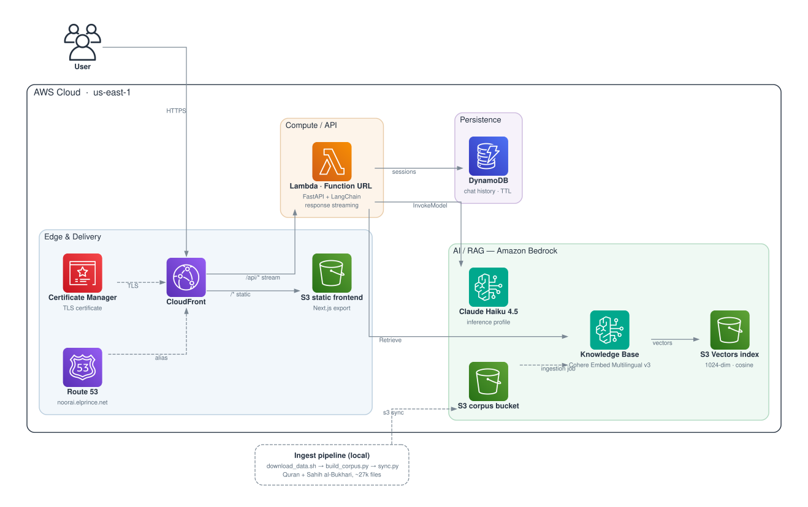

# 🌙 Noor AI — Technical Deep Dive

> Companion document to the [Marp decks](presentation/) — `slides.md` (portfolio video) and `deep-dive.md` (full technical deck).
> The main [README](../README.md) covers setup; this covers **how it works inside**.

**Noor AI** is a serverless, agentic RAG application that answers Islamic
questions grounded in primary sources — the Quran, Sahih al-Bukhari, and
Sahih Muslim — with
verbatim citations it cannot fabricate, madhab-aware rulings, conversation
memory, and token-by-token streaming. Live at
[noorai.elprince.net](https://noorai.elprince.net).

---

## 1. The Problem & The Approach

LLMs answer religious questions confidently — and sometimes invent Quran verses
or hadith that don't exist. For a domain where **citation integrity is
everything**, that's disqualifying.

Noor AI's answer to that problem is threefold:

1. **Agentic RAG** — the model must *search* primary sources with tools
   (`search_quran`, `search_hadith`) before answering.
2. **Citations as data, not generation** — every retrievable chunk carries a
   `citation` computed at ingestion time (e.g. `Quran 2:255`). The model is
   instructed to only reuse bracketed citations returned by the tools.
3. **Madhab awareness** — the prompt forces explicit treatment of ikhtilaf
   (differences between the four Sunni schools) instead of false consensus.

## 2. Architecture



**Request path:** Route 53 → CloudFront → (static from S3 | `/api/*` to a
streaming Lambda Function URL) → FastAPI + LangChain agent → Bedrock
(Claude Haiku 4.5 + Knowledge Base) → DynamoDB for memory.

**Ingestion path (offline):** `download_data.sh` → `build_corpus.py` →
`sync.py` → S3 corpus bucket → Bedrock KB ingestion job → Cohere embeddings →
S3 Vectors index.

### Five CDK stacks, one responsibility each

| Stack | Owns | Why separate |
|-------|------|--------------|
| `NoorAi-Dns` | Route 53 hosted zone + ACM cert | us-east-1 requirement, one-time setup |
| `NoorAi-Data` | DynamoDB chat table | data lifecycle ≠ compute lifecycle |
| `NoorAi-KnowledgeBase` | Corpus bucket, S3 Vectors, Bedrock KB | RAG storage is long-lived |
| `NoorAi-Api` | Lambda + Function URL + IAM | stateless, safe to redeploy |
| `NoorAi-Web` | Frontend bucket + CloudFront | delivery only |

### Notable infra choices

- **No API Gateway.** The Lambda exposes a **Function URL** with
  `RESPONSE_STREAM` invoke mode; CloudFront's `/api/*` behavior fronts it.
  Simpler, cheaper, and it streams.
- **No Docker.** FastAPI runs inside the managed Python runtime via the
  **AWS Lambda Web Adapter** layer (`run.sh` starts uvicorn). Python deps are
  bundled on the host with `uv` at synth time.
- **S3 Vectors** instead of OpenSearch Serverless — a fraction of the cost for
  a corpus of this size, fully serverless.
- **Single origin, no CORS.** The frontend calls `/api/*` on its own domain;
  CloudFront routes it. CORS exists only for local dev.

```ts
// infra/lib/api-stack.ts — FastAPI on Lambda, streaming, no Docker
const apiFunction = new lambda.Function(this, 'ApiFunction', {
  runtime: lambda.Runtime.PYTHON_3_12,
  handler: 'run.sh',                       // LWA startup script (uvicorn)
  code: pythonLambdaCode(backendDir, ['src', 'run.sh']),
  layers: [lwaLayer],                      // AWS Lambda Web Adapter
  environment: {
    AWS_LWA_INVOKE_MODE: 'response_stream',
    AWS_LWA_READINESS_CHECK_PATH: '/api/health',
    PORT: '8000',
    // ...
  },
});

const fnUrl = apiFunction.addFunctionUrl({
  authType: lambda.FunctionUrlAuthType.NONE,
  invokeMode: lambda.InvokeMode.RESPONSE_STREAM,  // token-by-token to the client
});
```

## 3. The RAG Corpus — citations you can't fabricate

The key design decision lives in the **ingestion pipeline**, not the runtime:

- `build_corpus.py` splits raw dumps into **one file per verse / per hadith**
  (~21k sources, ~43k files with sidecars), each with a `.metadata.json`
  sidecar containing a **precomputed citation** string.
- Retrieval units are therefore always whole verses/hadith — never truncated
  or merged mid-thought.
- At answer time, the model quotes the citation *from metadata*; it never
  composes one.

```jsonc
// ingest/data/corpus/quran/2_255.json.metadata.json (shape)
{
  "metadataAttributes": {
    "citation":    { "value": { "stringValue": "Quran 2:255" }, ... },
    "source_type": { "value": { "stringValue": "quran" }, ... }
  }
}
```

The Knowledge Base embeds with **Cohere Embed Multilingual v3** (1024-dim,
cosine) so Arabic and English queries both land on the right passages, stored
in an **S3 Vectors** index:

```ts
// infra/lib/knowledge-base-stack.ts
const vectorIndex = new s3vectors.CfnIndex(this, 'VectorIndex', {
  vectorBucketName: vectorBucket.vectorBucketName!,
  indexName: VECTOR_INDEX_NAME,
  dataType: 'float32',
  dimension: 1024,            // Cohere Embed Multilingual v3
  distanceMetric: 'cosine',
  metadataConfiguration: {    // chunk text is too big to be filterable
    nonFilterableMetadataKeys: ['AMAZON_BEDROCK_TEXT', 'AMAZON_BEDROCK_METADATA'],
  },
});
```

## 4. Backend — one class, one job

The backend is deliberately small (~630 lines) and follows strict single
responsibility. Every layer can be unit-tested or replaced independently:

```
app.py                 HTTP edge: validation, NDJSON streaming, error surfacing
└─ ChatService         orchestrator façade — the API's single entry point
   └─ ConversationChain agentic turn: history → agent → events → persist
      ├─ AgentFactory      builds the tool-calling agent (singleton)
      │  ├─ LLMService     ChatBedrockConverse singleton + content parsing
      │  ├─ RagToolset     @tool adapters: search_quran / search_hadith
      │  │  └─ RetrievalService  bedrock-agent-runtime Retrieve → domain objects
      │  │     └─ ContextBuilder [citation] evidence formatting
      │  └─ prompts/       system prompt: citation + madhab rules
      ├─ MemoryService     DynamoDB-backed chat history
      └─ AgentEvent        NDJSON wire contract (token / tool_start / tool_end / done)
```

### 4.1 ChatService — the façade

```python
class ChatService:
    """Single entry point for the API layer."""

    def __init__(self):
        self._conversation = ConversationChain()

    async def ask_stream(self, request: AskRequest):
        """Yields AgentEvents (tool steps + answer tokens + done)."""
        async for event in self._conversation.astream(
            question=request.question,
            session_id=request.session_id,
            school=request.school,
        ):
            yield event
```

### 4.2 AgentFactory — construction vs execution

LangChain 1.0's `create_agent` wires model + tools + prompt into a compiled
graph. It's a **singleton** — Lambda containers are reused, so the agent is
built once per container, not per request:

```python
class AgentFactory:
    _agent = None

    @classmethod
    def get_agent(cls):
        if cls._agent is None:
            cls._agent = create_agent(
                model=LLMService.get_model(),        # ChatBedrockConverse
                tools=RagToolset().as_tools(),       # search_quran, search_hadith
                system_prompt=AGENT_SYSTEM_PROMPT,   # citation + madhab rules
            )
        return cls._agent
```

### 4.3 RagToolset — tools the agent can call

Each tool is a thin adapter: agent query → filtered retrieval → formatted
evidence. The docstring *is* the tool's interface — it's what the model reads
to decide when and how to call it:

```python
@tool
def search_quran(query: str) -> str:
    """Search the Quran for verses relevant to a topic or question.

    `query` should be a concise concept, e.g. "reward of patience".
    Returns verses prefixed with their citation, e.g. [Quran 2:255].
    """
    chunks = retriever.retrieve(query, source_type="quran")
    return ContextBuilder.build(chunks)
```

### 4.4 RetrievalService — raw API → domain objects

```python
@dataclass(frozen=True)
class RetrievedChunk:
    text: str
    citation: str      # authoritative, from ingestion-time metadata
    source_type: str   # "quran" | "hadith"
    score: float

class RetrievalService:
    @classmethod
    def retrieve(cls, query, source_type=None, top_k=None) -> list[RetrievedChunk]:
        vector_config = {"numberOfResults": top_k or config.retrieval_top_k}
        if source_type:
            vector_config["filter"] = {
                "equals": {"key": "source_type", "value": source_type}}

        response = cls._get_client().retrieve(
            knowledgeBaseId=config.knowledge_base_id,
            retrievalQuery={"text": query},
            retrievalConfiguration={"vectorSearchConfiguration": vector_config},
        )
        return [cls._to_chunk(r) for r in response.get("retrievalResults", [])]
```

The rest of the app never touches raw boto3 response shapes.

### 4.5 ConversationChain — the agentic turn

The heart of the backend. Each turn: **load history → run agent → translate
LangChain events into AgentEvents → persist**. A subtle detail: any text the
model emits *before* calling a tool is preamble ("Let me search…") — it's
discarded from the persisted answer:

```python
async def astream(self, question, session_id, school="general"):
    history = MemoryService.get_history(session_id)
    messages = self._build_messages(question, school, history.messages)

    answer_parts, tool_starts = [], {}
    async for event in self._agent.astream_events({"messages": messages}, version="v2"):
        kind = event["event"]

        if kind == "on_chat_model_stream":
            text = LLMService.extract_text(event["data"]["chunk"].content)
            if text:
                answer_parts.append(text)
                yield AgentEvent.token(text)

        elif kind == "on_tool_start":
            answer_parts.clear()          # pre-tool preamble — discard
            tool_starts[event["run_id"]] = time.monotonic()
            yield AgentEvent.tool_start(event["run_id"], event["name"], ...)

        elif kind == "on_tool_end":
            ms = int((time.monotonic() - tool_starts.pop(event["run_id"])) * 1000)
            yield AgentEvent.tool_end(event["run_id"], event["name"], ms, count)

    history.add_message(HumanMessage(content=question))
    history.add_message(AIMessage(content="".join(answer_parts)))
    yield AgentEvent.done()
```

### 4.6 AgentEvent — the wire contract

One place owns the streaming protocol. Each event is one NDJSON line, so the
frontend can render agent steps ("Searching the Quran… 5 results, 320 ms")
*while* the answer streams:

```python
@dataclass(frozen=True)
class AgentEvent:
    type: str   # "token" | "tool_start" | "tool_end" | "done" | "error"
    data: dict = field(default_factory=dict)

    def to_ndjson(self) -> str:
        return json.dumps({"type": self.type, **self.data}, ensure_ascii=False) + "\n"
```

```json
{"type": "tool_start", "id": "…", "tool": "search_quran", "query": "pillars of Islam"}
{"type": "tool_end",   "id": "…", "tool": "search_quran", "ms": 312, "count": 5}
{"type": "token", "text": "The five pillars"}
{"type": "done"}
```

### 4.7 MemoryService — DynamoDB chat history

Implements LangChain's `BaseChatMessageHistory` on a DynamoDB table keyed by
`(SessionId, MessageIndex)`, with TTL for automatic cleanup:

```python
def add_message(self, message: BaseMessage) -> None:
    count = self._table.query(          # next index = current count
        KeyConditionExpression="SessionId = :sid",
        ExpressionAttributeValues={":sid": self._session_id},
        Select="COUNT",
    )["Count"]
    self._table.put_item(Item={
        "SessionId": self._session_id,
        "MessageIndex": count,
        "MessageData": json.dumps(message_to_dict(message)),
        "TTL": int(time.time()) + config.session_ttl_hours * 3600,
    })
```

### 4.8 The prompt — where domain rigor lives

The system prompt encodes the domain rules:

- **Search first** — call the tools before answering anything scriptural.
- **Cite only what the tools returned** — bracketed references only; never
  attach a citation to a fiqh ruling (primary texts ≠ madhab rulings).
- **State ikhtilaf explicitly** — name the madhahib and their positions; never
  claim false consensus. Precise terms per school (fard vs wajib…).
- **Fixed response structure** — brief answer → evidence → ruling by madhab →
  practical conclusion.

## 5. Streaming end-to-end

The stream survives every hop untouched — no buffering anywhere:

```
Claude tokens → LangChain astream_events → AgentEvent NDJSON lines
  → FastAPI StreamingResponse → Lambda Web Adapter (response_stream)
  → Function URL (RESPONSE_STREAM) → CloudFront (caching disabled on /api/*)
  → fetch() ReadableStream → Zustand store → React
```

One FastAPI subtlety: the first event is pulled **eagerly** so pre-stream
failures (e.g. Bedrock access) surface as a proper HTTP 500 instead of a
broken 200 stream.

The frontend consumes it with nothing but `fetch`:

```ts
const reader = res.body.getReader();
const decoder = new TextDecoder();
let buffer = "";

for (;;) {
  const { done, value } = await reader.read();
  if (done) break;
  buffer += decoder.decode(value, { stream: true });
  // split on \n, JSON.parse each complete line → onEvent(event)
}
```

## 6. Frontend

Next.js static export (no server), TypeScript, Tailwind. Key components:

| Component | Role |
|-----------|------|
| `ChatWindow` | conversation view, streams tokens as they arrive |
| `MessageBubble` | renders answers; bracketed citations become styled chips |
| `SchoolSelector` | madhab preference (hanafi/maliki/shafii/hanbali/general) |
| `Sidebar` + `chatStore` | session management (Zustand) |
| `AuroraBackground` | the pretty part |
| `lib/api.ts` | typed `NoorApiClient` — NDJSON stream parser |

## 7. Cost

Everything is pay-per-use; idle cost is ~$0.50/month (Route 53 zone).

| Item | At low traffic |
|------|----------------|
| Bedrock tokens (Claude Haiku 4.5) | the main variable, ~$1–8/mo |
| Embeddings (one-time ingestion) | ~$1 for the full corpus |
| Lambda + DynamoDB + S3 + CloudFront | pennies |
| S3 Vectors | ~10× cheaper than OpenSearch Serverless minimum |

## 8. Design principles recap

1. **Trust is a data problem** — citations are precomputed at ingestion, not
   generated at answer time.
2. **One class, one job** — every service is independently testable; the
   toolset takes an injected retriever.
3. **Singletons where Lambda rewards them** — model, agent, boto3 clients
   survive across invocations via container reuse.
4. **Own your wire contract** — `AgentEvent` is defined once, used by both
   producer (chain) and consumer (frontend types mirror it).
5. **Serverless everything** — zero idle compute, and the whole stack tears
   down with `cdk destroy`.
